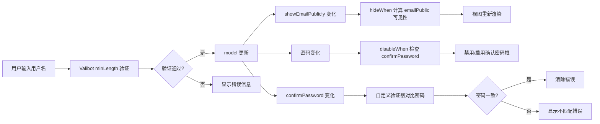

# 综合示例：完整业务表单

本文通过一个注册表单的综合示例，整合前面所学的所有知识点。

## 需求描述

实现一个用户注册表单，包含以下功能：

1. **基本信息**：用户名（必填）、邮箱（可选）、年龄（必填）
2. **密码设置**：密码 + 确认密码（需一致），强度提示联动
3. **隐私设置**：开关控制是否显示邮箱，条件隐藏/显示补充字段
4. **兴趣爱好**：动态标签列表，可增删
5. **自我介绍**：可选的长文本

## 完整 Schema 定义

```typescript
import * as v from 'valibot';
import { formConfig, setComponent, hideWhen, disableWhen, actions } from '@piying/view-angular-core';
import { map } from 'rxjs';

// 主 Schema
export const registerSchema = v.object({
  // === 基本信息 ===
  username: v.pipe(v.string(), v.minLength(2, '用户名至少 2 个字符'), setComponent('input'), formConfig({ required: true })),

  email: v.pipe(v.optional(v.email('请输入有效邮箱')), setComponent('input')),

  age: v.pipe(v.number(), v.minValue(18, '必须年满 18 岁'), v.maxValue(120, '年龄输入不合理'), setComponent('number-input'), formConfig({ required: true })),

  // === 密码设置 ===
  password: v.pipe(
    v.string(),
    v.minLength(8, '密码至少 8 个字符'),
    setComponent('password-input'),
    formConfig({
      validators: [
        (control) => {
          if (control.value.includes('123')) {
            return { weakPassword: '密码不能包含连续数字' };
          }
          return null;
        },
      ],
    }),
  ),

  confirmPassword: v.pipe(
    v.string(),
    v.minLength(8, '请再次输入密码'),
    setComponent('password-input'),
    formConfig({
      validators: [
        (control) => {
          const parent = control.root;
          if (parent.value?.password !== control.value) {
            return { passwordsNotMatch: '两次密码不一致' };
          }
          return null;
        },
      ],
    }),
  ),

  // === 隐私设置 ===
  showEmailPublicly: v.boolean(),

  emailPublic: v.pipe(
    v.string(),
    setComponent('input'),
    hideWhen({
      listen: (fn) =>
        fn({ list: [['..', 'showEmailPublicly']] }).pipe(
          map((item) => !item.list[0]), // 关闭公开显示时隐藏
        ),
    }),
  ),

  bio: v.pipe(v.nullable(v.string()), setComponent('textarea')),

  // === 兴趣爱好 ===
  hobbies: v.array(v.string()),
});
```

## Angular 组件实现

```typescript
import { Component, signal } from '@angular/core';
import { PiyingView } from '@piying/view-angular';
import { registerSchema } from './register-schema';

@Component({
  selector: 'app-register',
  standalone: true,
  imports: [PiyingView],
  template: ` <piying-view [schema]="schema" [(model)]="model" [options]="options"></piying-view> `,
})
export class RegisterComponent {
  // 初始模型（可选，表单会自动填充默认值）
  model = signal({
    username: '',
    age: 18,
    email: undefined,
    password: '',
    confirmPassword: '',
    showEmailPublicly: false,
    hobbies: [],
  });

  // Options 配置
  options = {
    fieldGlobalConfig: {
      types: {
        input: { type: InputComponent },
        'number-input': { type: NumberInputComponent },
        'password-input': { type: PasswordInputComponent },
        textarea: { type: TextareaComponent },
        object: { type: PiyingViewGroup }, // 嵌套对象容器
        array: { type: PiyingViewGroup }, // 数组容器
      },
    },
  };

  // Schema
  schema = registerSchema;
}
```

## 组件类型注册

### InputComponent（通用输入框）

```typescript
import { Component, input, output } from '@angular/core';

@Component({
  selector: 'input-field',
  standalone: true,
  template: `
    <label>{{ label() }}</label>
    <input [placeholder]="placeholder()" [disabled]="disabled()" (input)="onChange($event.target.value)" />
  `,
})
export class InputComponent {
  label = input('');
  placeholder = input('');
  disabled = input(false);
  onChange = output<string>();
}
```

### PasswordInputComponent（密码输入框）

```typescript
@Component({
  selector: 'password-field',
  standalone: true,
  template: `
    <label>{{ label() }}</label>
    <input type="password" [disabled]="disabled()" (input)="onChange($event.target.value)" />
  `,
})
export class PasswordInputComponent {
  label = input('');
  disabled = input(false);
  onChange = output<string>();
}
```

## 动态联动效果

### 密码强度提示（使用 hideWhen）

```typescript
import { hideWhen } from '@piying/view-angular-core';
import { map } from 'rxjs';

// 在 Schema 中定义一个隐藏的密码强度字段
const schema = v.object({
  password: v.string(),

  passwordStrength: v.pipe(
    v.string(),
    hideWhen({
      listen: (fn) =>
        fn({ list: [['..', 'password']] }).pipe(
          map((item) => !item.list[0]), // 没有密码时隐藏
        ),
    }),
  ),

  confirmPassword: v.pipe(
    v.string(),
    disableWhen({
      listen: (fn) =>
        fn({ list: [['..', 'password']] }).pipe(
          map((item) => !item.list[0]), // 没有密码时禁用确认框
        ),
    }),
  ),
});
```

### 动态标签列表（Array 操作）

在模板中实现增删标签：

```typescript
@Component({
  standalone: true,
  templateUrl: './tags.component.html',
})
export class TagsComponent {
  @Input() model!: Signal<string[]>;
  @Output() modelChange = new EventEmitter<string[]>();

  addTag() {
    const current = this.model();
    this.modelChange.emit([...current, '']);
  }

  removeTag(index: number) {
    const current = this.model();
    this.modelChange.emit(current.filter((_, i) => i !== index));
  }
}
```

## 表单提交处理

```typescript
export class RegisterComponent {
  onSubmit() {
    const model = this.model();

    // 校验通过后才允许提交
    if (model.password !== model.confirmPassword) {
      alert('两次密码不一致');
      return;
    }

    console.log('注册数据:', {
      username: model.username,
      email: model.email,
      age: model.age,
      hobbies: model.hobbies,
      bio: model.bio,
      preferences: {
        showEmailPublicly: model.showEmailPublicly,
        emailPublic: model.emailPublic ?? '未设置',
      },
    });
  }
}
```

## 数据流总结



## 关键点回顾

| 功能       | 使用的 API                          | 说明                       |
| ---------- | ----------------------------------- | -------------------------- |
| 必填验证   | `formConfig({ required: true })`    | + Valibot `v.minLength()`  |
| 自定义验证 | `formConfig({ validators: [...] })` | 密码强度检查、确认密码匹配 |
| 条件隐藏   | `hideWhen`                          | 公开邮箱设置切换           |
| 条件禁用   | `disableWhen`                       | 未设密码时禁用确认框       |
| 动态数组   | `v.array()` + FieldArray API        | 增删标签                   |
| 嵌套容器   | `fieldGlobalConfig.types.object`    | Group 递归渲染子字段       |

## 下一步

- [API: setComponent](../api/setComponent.md) — 组件设置详解
- [API: inputs](../api/inputs.md)、[API: outputs](../api/outputs.md) — 组件输入输出设置
- [API: hideWhen/disableWhen/valueChange](../api/hide-disable.md) — 动态控制 API
