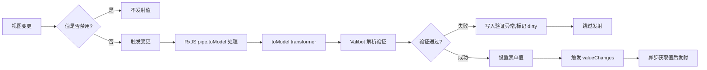
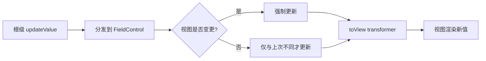

# 值转换与联动

本文介绍如何使用 `transformer` 和 Valibot 的 `transform` Action 实现视图层与模型层的值转换。

## Transformer（toModel / toView）

`formConfig.transformer` 提供两个转换钩子：

| 方法      | 方向        | 说明                             |
| --------- | ----------- | -------------------------------- |
| `toView`  | 模型 → 视图 | 存入模型的原始值转换为视图显示值 |
| `toModel` | 视图 → 模型 | 用户输入的值转换为存入模型的值   |

### toModel — 视图到模型

```typescript
import * as v from 'valibot';
import { formConfig } from '@piying/view-angular-core';

const schema = v.object({
  price: v.pipe(
    v.string(), // 视图层是字符串（"19.99"）
    formConfig({
      transformer: {
        toModel: (value: any) => parseFloat(value), // 存入模型为数字 19.99
      },
    }),
  ),
});
```

### toView — 模型到视图

```typescript
const schema = v.object({
  date: v.pipe(
    v.string(), // 模型层存储 ISO 字符串
    formConfig({
      transformer: {
        toView: (value: any) => new Date(value).toLocaleDateString(), // 视图显示本地化日期
      },
    }),
  ),
});
```

### Pipe（rxjs Observable 管道）

`formConfig.pipe.toModel` 使用 RxJS Observable 进行值转换，支持去抖、过滤等操作：

```typescript
import { debounceTime, filter, map, pipe } from 'rxjs';
import { formConfig } from '@piying/view-angular-core';

const schema = v.object({
  search: v.pipe(
    v.string(),
    formConfig({
      pipe: {
        toModel: pipe(
          debounceTime(300), // 300ms 去抖
          filter((v) => v.trim().length > 0), // 过滤空字符串
          map((v) => v.toLowerCase()), // 转小写
        ),
      },
    }),
  ),
});
```

### Pipe 验证示例

```typescript
import { debounceTime, pipe } from 'rxjs';
import { formConfig } from '@piying/view-angular-core';

const obj = v.pipe(
  v.string(),
  formConfig({
    pipe: {
      toModel: pipe(map((item) => `${item}1`)),
    },
  }),
);

const result = createBuilder(obj);
result.form.control!.viewValueChange('2');
expect(result.form.control!.value).toEqual('21'); // ✅ toModel 转换生效
```

### Pipe 去抖验证

```typescript
import { debounceTime } from 'rxjs';

const obj = v.pipe(
  v.string(),
  formConfig({
    pipe: {
      toModel: pipe(debounceTime(1)),
    },
  }),
);

const result = createBuilder(obj);
result.form.control!.viewValueChange('1');
// 去抖期间值未更新
expect(result.form.control!.value).not.toEqual('1');
// 等待去抖完成后值生效
await delay(2);
expect(result.form.control!.value).toEqual('1');
```

### Pipe 过滤验证

```typescript
import { filter, pipe } from 'rxjs';

const obj = v.pipe(
  v.string(),
  formConfig({
    pipe: {
      toModel: pipe(filter((item) => item === '1')),
    },
  }),
);

const result = createBuilder(obj);
result.form.control!.viewValueChange('1'); // 通过过滤
result.form.control!.viewValueChange('2'); // 被过滤掉

expect(result.form.control!.value).toEqual('1'); // ✅ 只有 '1' 生效
```

## Valibot Transform（Schema 级转换）

Valibot 内置的 `v.transform()` 在 Schema 层面进行值转换，Piying-View 会保留此行为：

### v.transform — 基本用法

```typescript
import * as v from 'valibot';

const schema = v.object({
  age: v.pipe(
    v.string(), // 视图层字符串
    v.transform((value) => parseInt(value, 10)), // 转换为数字存入模型
  ),
});
```

### v.transform — 嵌套对象展平

将嵌套对象展平为单个字段：

```typescript
const schema = v.object({
  fullName: v.pipe(
    v.object({ first: v.string(), last: v.string() }),
    v.transform((obj) => `${obj.first} ${obj.last}`), // 展平为 "张三"
  ),
});
```

### v.transform — 数组转换

```typescript
const schema = v.object({
  tags: v.pipe(
    v.array(v.string()),
    v.transform((arr) => arr.join(',')), // ['a', 'b'] → 'a,b'
  ),
});
```

## Transformer vs Valibot Transform

| 特性      | `formConfig.transformer` | `v.transform()`                    |
| --------- | ------------------------ | ---------------------------------- |
| 作用层    | Form Control 配置        | Valibot Schema                     |
| toView    | ✅ 支持                  | ❌ 不支持（需 `v.transform` 反向） |
| toModel   | ✅ 支持                  | ✅ 支持（等价于 toModel）          |
| Pipe 支持 | ✅ 完整 RxJS 管道        | ❌ 不支持                          |
| 适用场景  | UI/模型双向转换          | Schema 类型验证 + 转换             |

## 完整示例：表单联动

```typescript
import * as v from 'valibot';
import { formConfig } from '@piying/view-angular-core';
import { debounceTime, filter, map, pipe } from 'rxjs';

const schema = v.object({
  // 搜索框：去抖 + 过滤 + 转小写
  search: v.pipe(
    v.string(),
    formConfig({
      pipe: {
        toModel: pipe(
          debounceTime(300),
          filter((v) => v.trim().length > 0),
          map((v) => v.toLowerCase()),
        ),
      },
    }),
  ),

  // 价格：字符串输入 → 数字存储
  price: v.pipe(
    v.string(),
    formConfig({
      transformer: {
        toModel: (value: any) => parseFloat(value),
        toView: (value: any) => value?.toFixed(2) ?? '0.00',
      },
    }),
  ),

  // 日期：ISO 字符串存储 → 本地化显示
  birthDate: v.pipe(
    v.string(),
    formConfig({
      transformer: {
        toView: (value: any) => (value ? new Date(value).toISOString().split('T')[0] : ''),
      },
    }),
  ),

  // 邮箱：使用 Valibot transform 做类型转换
  score: v.pipe(
    v.string(),
    v.transform((v) => parseInt(v, 10)), // Schema 级转换
    v.minValue(0),
    v.maxValue(100),
  ),
});
```

## 数据流图

### 视图 → 模型（View → Model）完整链路



### 模型 → 视图（Model → View）完整链路



## 下一步

- [自定义验证](custom-validation.md) — validators / asyncValidators
- [数组高级用法](array-advanced.md) — deletionMode / groupMode
- [API: FieldFormConfig](../api/field-config.md) — transformer / pipe 配置详解
