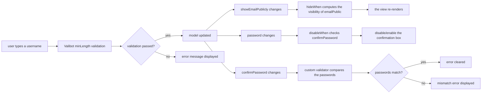

import LivePreview from '../../../../components/LivePreview.astro';
import { CompleteExampleDemoComponent } from '../../../../angular/components/complete-example-demo.component.ts';

This example combines everything you have learned into a single registration form.

<LivePreview path="src/angular/components/complete-example-demo.component.ts">
  <CompleteExampleDemoComponent slot="preview" client:only="angular" />
</LivePreview>

## Requirements

Build a user registration form with:

1. **Basic info**: username (required), email (optional), age (required)
2. **Password**: password + confirmation (must match) with a strength hint linkage
3. **Privacy**: a switch controlling whether the email is public, conditionally hidden/shown extra fields
4. **Interests**: a dynamic tag list with add/remove
5. **Bio**: an optional long text

## Complete Schema Definition

```typescript
import * as v from 'valibot';
import { formConfig, setComponent, hideWhen, disableWhen, actions } from '@piying/view-angular-core';
import { map } from 'rxjs';

// main schema
export const registerSchema = v.object({
  // === basic info ===
  username: v.pipe(v.string(), v.minLength(2, 'Username must be at least 2 characters'), setComponent('input'), formConfig({ required: true })),

  email: v.pipe(v.optional(v.pipe(v.string(), v.email('Please enter a valid email address'))), setComponent('input')),

  age: v.pipe(v.number(), v.minValue(18, 'You must be at least 18 years old'), v.maxValue(120, 'This age is not valid'), setComponent('number-input'), formConfig({ required: true })),

  // === password ===
  password: v.pipe(
    v.string(),
    v.minLength(8, 'Password must be at least 8 characters'),
    setComponent('password-input'),
    formConfig({
      validators: [
        (control) => {
          if (control.value.includes('123')) {
            return { weakPassword: 'Password must not contain consecutive digits' };
          }
          return null;
        },
      ],
    }),
  ),

  confirmPassword: v.pipe(
    v.string(),
    v.minLength(8, 'Please enter the password again'),
    setComponent('password-input'),
    formConfig({
      validators: [
        (control) => {
          const parent = control.root;
          if (parent.value?.password !== control.value) {
            return { passwordsNotMatch: 'The two passwords do not match' };
          }
          return null;
        },
      ],
    }),
  ),

  // === privacy ===
  showEmailPublicly: v.boolean(),

  emailPublic: v.pipe(
    v.string(),
    setComponent('input'),
    hideWhen({
      listen: (fn) =>
        fn({ list: [['..', 'showEmailPublicly']] }).pipe(
          map((item) => !item.list[0]), // hide it when public display is off
        ),
    }),
  ),

  bio: v.pipe(v.nullable(v.string()), setComponent('textarea')),

  // === interests ===
  hobbies: v.array(v.string()),
});
```

## Angular Component Implementation

```typescript
import { Component, signal } from '@angular/core';
import { PiyingView } from '@piying/view-angular';
import { registerSchema } from './register-schema';

@Component({
  selector: 'app-register',
  standalone: true,
  imports: [PiyingView],
  template: ` <piying-view [schema]="schema" [(model)]="model" [options]="options"></piying-view> `,
})
export class RegisterComponent {
  // initial model (optional, the form fills in defaults automatically)
  model = signal({
    username: '',
    age: 18,
    email: undefined,
    password: '',
    confirmPassword: '',
    showEmailPublicly: false,
    hobbies: [],
  });

  // Options configuration
  options = {
    fieldGlobalConfig: {
      types: {
        input: { type: InputComponent },
        'number-input': { type: NumberInputComponent },
        'password-input': { type: PasswordInputComponent },
        textarea: { type: TextareaComponent },
        object: { type: PiyingViewGroup }, // nested object container
        array: { type: PiyingViewGroup }, // array container
      },
    },
  };

  // Schema
  schema = registerSchema;
}
```

## Registering Component Types

### InputComponent (generic text input)

```typescript
import { Component, input, output } from '@angular/core';

@Component({
  selector: 'input-field',
  standalone: true,
  template: `
    <label>{{ label() }}</label>
    <input [placeholder]="placeholder()" [disabled]="disabled()" (input)="onChange($event.target.value)" />
  `,
})
export class InputComponent {
  label = input('');
  placeholder = input('');
  disabled = input(false);
  onChange = output<string>();
}
```

### PasswordInputComponent (password input)

```typescript
@Component({
  selector: 'password-field',
  standalone: true,
  template: `
    <label>{{ label() }}</label>
    <input type="password" [disabled]="disabled()" (input)="onChange($event.target.value)" />
  `,
})
export class PasswordInputComponent {
  label = input('');
  disabled = input(false);
  onChange = output<string>();
}
```

## Dynamic Linkage

### Password Strength Hint (with hideWhen)

```typescript
import { hideWhen } from '@piying/view-angular-core';
import { map } from 'rxjs';

// define a hidden password strength field in the schema
const schema = v.object({
  password: v.string(),

  passwordStrength: v.pipe(
    v.string(),
    hideWhen({
      listen: (fn) =>
        fn({ list: [['..', 'password']] }).pipe(
          map((item) => !item.list[0]), // hide it when there is no password
        ),
    }),
  ),

  confirmPassword: v.pipe(
    v.string(),
    disableWhen({
      listen: (fn) =>
        fn({ list: [['..', 'password']] }).pipe(
          map((item) => !item.list[0]), // disable the confirmation box when there is no password
        ),
    }),
  ),
});
```

### Dynamic Tag List (Array Operations)

Add and remove tags in the template:

```typescript
import { Component, input, output } from '@angular/core';

@Component({
  standalone: true,
  templateUrl: './tags.component.html',
})
export class TagsComponent {
  model = input.required<string[]>();
  modelChange = output<string[]>();

  addTag() {
    const current = this.model();
    this.modelChange.emit([...current, '']);
  }

  removeTag(index: number) {
    const current = this.model();
    this.modelChange.emit(current.filter((_, i) => i !== index));
  }
}
```

## Handling Form Submission

```typescript
export class RegisterComponent {
  onSubmit() {
    const model = this.model();

    // only submit when validation passes
    if (model.password !== model.confirmPassword) {
      alert('The two passwords do not match');
      return;
    }

    console.log('registration data:', {
      username: model.username,
      email: model.email,
      age: model.age,
      hobbies: model.hobbies,
      bio: model.bio,
      preferences: {
        showEmailPublicly: model.showEmailPublicly,
        emailPublic: model.emailPublic ?? 'not set',
      },
    });
  }
}
```

## Data Flow Summary



## Next Steps

- [API: setComponent](en/api/setcomponent/) — details of component registration
- [API: inputs](en/api/inputs/), [API: outputs](en/api/outputs/) — component input and output configuration
- [API: hideWhen/disableWhen/valueChange](en/api/hide-disable/) — dynamic control API
