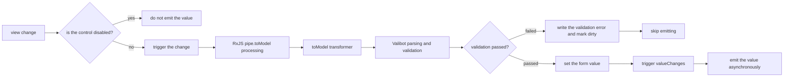
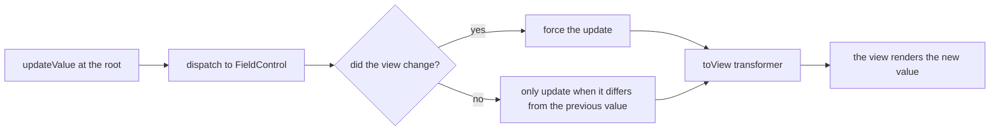

import SchemaPreview from '../../../../components/SchemaPreview.astro';
import { SchemaDemoComponent } from '../../../../angular/components/schema-demo.component.ts';

This page shows how to transform values between the view layer and the model layer with `transformer` and Valibot's `transform` Action.

<SchemaPreview definition="src/angular/definition/transform-demo.definition.ts">
  <SchemaDemoComponent slot="preview" client:only="angular" name="transform-demo" />
</SchemaPreview>

## Transformer (toModel / toView)

`formConfig.transformer` provides two transformation hooks:

| Hook      | Direction     | Description                             |
| --------- | ----------- | -------------------------------- |
| `toView`  | model → view | Turns the raw model value into the displayed value |
| `toModel` | view → model | Turns the user input into the value stored in the model |

### toModel — View to Model

<SchemaPreview definition="src/angular/definition/transform-to-model.definition.ts">
  <SchemaDemoComponent slot="preview" client:only="angular" name="transform-to-model" />
</SchemaPreview>

### toView — Model to View

<SchemaPreview definition="src/angular/definition/transform-to-view.definition.ts">
  <SchemaDemoComponent slot="preview" client:only="angular" name="transform-to-view" />
</SchemaPreview>

### Pipe (RxJS Observable Pipe)

`formConfig.pipe.toModel` transforms values with an RxJS observable, supporting debouncing, filtering and more:

<SchemaPreview definition="src/angular/definition/transform-pipe.definition.ts">
  <SchemaDemoComponent slot="preview" client:only="angular" name="transform-pipe" />
</SchemaPreview>

### Pipe Validation Example

> The examples below are excerpted from the unit tests (`createBuilder` / `delay` are internal test utilities, not public APIs; in a real project just build the field with `convertToField`).

```typescript
import { map, pipe } from 'rxjs';
import { formConfig } from '@piying/view-angular-core';

const obj = v.pipe(
  v.string(),
  formConfig({
    pipe: {
      toModel: pipe(map((item) => `${item}1`)),
    },
  }),
);

const result = createBuilder(obj);
result.form.control!.viewValueChange('2');
expect(result.form.control!.value).toEqual('21'); // ✅ toModel transformation applied
```

### Pipe Debounce Validation

```typescript
import { debounceTime, pipe } from 'rxjs';

const obj = v.pipe(
  v.string(),
  formConfig({
    pipe: {
      toModel: pipe(debounceTime(1)),
    },
  }),
);

const result = createBuilder(obj);
result.form.control!.viewValueChange('1');
// the value has not been updated yet during the debounce window
expect(result.form.control!.value).not.toEqual('1');
// the value lands once the debounce completes
await delay(2);
expect(result.form.control!.value).toEqual('1');
```

### Pipe Filter Validation

```typescript
import { filter, pipe } from 'rxjs';

const obj = v.pipe(
  v.string(),
  formConfig({
    pipe: {
      toModel: pipe(filter((item) => item === '1')),
    },
  }),
);

const result = createBuilder(obj);
result.form.control!.viewValueChange('1'); // passes the filter
result.form.control!.viewValueChange('2'); // filtered out

expect(result.form.control!.value).toEqual('1'); // ✅ only '1' takes effect
```

## Valibot Transform (Schema-Level Transformation)

Valibot's built-in `v.transform()` transforms values at the schema level, and Piying-View preserves this behaviour:

### v.transform — Basic Usage

<SchemaPreview definition="src/angular/definition/transform-basic.definition.ts">
  <SchemaDemoComponent slot="preview" client:only="angular" name="transform-basic" />
</SchemaPreview>

### v.transform — Flattening Nested Objects

Flatten a nested object into a single field:

<SchemaPreview definition="src/angular/definition/transform-flatten.definition.ts">
  <SchemaDemoComponent slot="preview" client:only="angular" name="transform-flatten" />
</SchemaPreview>

### v.transform — Array Transformation

<SchemaPreview definition="src/angular/definition/transform-array.definition.ts">
  <SchemaDemoComponent slot="preview" client:only="angular" name="transform-array" />
</SchemaPreview>

## Transformer vs Valibot Transform

| Feature      | `formConfig.transformer` | `v.transform()`                   |
| --------- | ------------------------ | ---------------------------------- |
| Layer         | Form Control configuration | Valibot schema                   |
| toView        | ✅ supported              | ❌ not supported (needs an inverse `v.transform`) |
| toModel       | ✅ supported              | ✅ supported (equivalent to toModel) |
| Pipe support  | ✅ full RxJS pipes         | ❌ not supported                  |
| When to use   | UI/model two-way conversion | Schema type validation + conversion |

## Full Example

<SchemaPreview definition="src/angular/definition/transform-complete.definition.ts">
  <SchemaDemoComponent slot="preview" client:only="angular" name="transform-complete" />
</SchemaPreview>

## Data Flow Diagrams

### View → Model: the Full Chain



### Model → View: the Full Chain



## Next Steps

- [Custom Validation](en/scenarios/custom-validation/) — validators / asyncValidators
- [Advanced Array Usage](en/scenarios/array-advanced/) — deletionMode / groupMode
- [formConfig](en/api/form-config/) — details of transformer / pipe configuration
