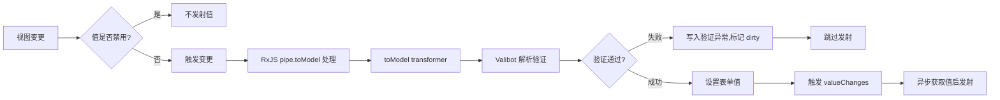
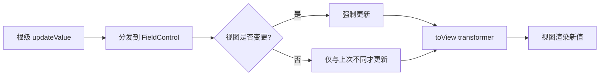

import LivePreview from '../../../../components/LivePreview.astro';
import SchemaPreview from '../../../../components/SchemaPreview.astro';
import { ValueTransformDemoComponent } from '../../../../angular/components/value-transform-demo.component.ts';
import { SchemaDemoComponent } from '../../../../angular/components/schema-demo.component.ts';

本文介绍如何使用 `transformer` 和 Valibot 的 `transform` Action 实现视图层与模型层的值转换。

<LivePreview path="src/angular/components/value-transform-demo.component.ts">
  <ValueTransformDemoComponent slot="preview" client:only="angular" />
</LivePreview>

## Transformer（toModel / toView）

`formConfig.transformer` 提供两个转换钩子：

| 方法      | 方向        | 说明                             |
| --------- | ----------- | -------------------------------- |
| `toView`  | 模型 → 视图 | 存入模型的原始值转换为视图显示值 |
| `toModel` | 视图 → 模型 | 用户输入的值转换为存入模型的值   |

### toModel — 视图到模型

<SchemaPreview definition="src/angular/components/definition/transform-to-model.definition.ts">
  <SchemaDemoComponent slot="preview" client:only="angular" name="transform-to-model" />
</SchemaPreview>

### toView — 模型到视图

<SchemaPreview definition="src/angular/components/definition/transform-to-view.definition.ts">
  <SchemaDemoComponent slot="preview" client:only="angular" name="transform-to-view" />
</SchemaPreview>

### Pipe（rxjs Observable 管道）

`formConfig.pipe.toModel` 使用 RxJS Observable 进行值转换，支持去抖、过滤等操作：

<SchemaPreview definition="src/angular/components/definition/transform-pipe.definition.ts">
  <SchemaDemoComponent slot="preview" client:only="angular" name="transform-pipe" />
</SchemaPreview>

### Pipe 验证示例

```typescript
import { debounceTime, pipe } from 'rxjs';
import { formConfig } from '@piying/view-angular-core';

const obj = v.pipe(
  v.string(),
  formConfig({
    pipe: {
      toModel: pipe(map((item) => `${item}1`)),
    },
  }),
);

const result = createBuilder(obj);
result.form.control!.viewValueChange('2');
expect(result.form.control!.value).toEqual('21'); // ✅ toModel 转换生效
```

### Pipe 去抖验证

```typescript
import { debounceTime } from 'rxjs';

const obj = v.pipe(
  v.string(),
  formConfig({
    pipe: {
      toModel: pipe(debounceTime(1)),
    },
  }),
);

const result = createBuilder(obj);
result.form.control!.viewValueChange('1');
// 去抖期间值未更新
expect(result.form.control!.value).not.toEqual('1');
// 等待去抖完成后值生效
await delay(2);
expect(result.form.control!.value).toEqual('1');
```

### Pipe 过滤验证

```typescript
import { filter, pipe } from 'rxjs';

const obj = v.pipe(
  v.string(),
  formConfig({
    pipe: {
      toModel: pipe(filter((item) => item === '1')),
    },
  }),
);

const result = createBuilder(obj);
result.form.control!.viewValueChange('1'); // 通过过滤
result.form.control!.viewValueChange('2'); // 被过滤掉

expect(result.form.control!.value).toEqual('1'); // ✅ 只有 '1' 生效
```

## Valibot Transform（Schema 级转换）

Valibot 内置的 `v.transform()` 在 Schema 层面进行值转换，Piying-View 会保留此行为：

### v.transform — 基本用法

<SchemaPreview definition="src/angular/components/definition/transform-basic.definition.ts">
  <SchemaDemoComponent slot="preview" client:only="angular" name="transform-basic" />
</SchemaPreview>

### v.transform — 嵌套对象展平

将嵌套对象展平为单个字段：

<SchemaPreview definition="src/angular/components/definition/transform-flatten.definition.ts">
  <SchemaDemoComponent slot="preview" client:only="angular" name="transform-flatten" />
</SchemaPreview>

### v.transform — 数组转换

<SchemaPreview definition="src/angular/components/definition/transform-array.definition.ts">
  <SchemaDemoComponent slot="preview" client:only="angular" name="transform-array" />
</SchemaPreview>

## Transformer vs Valibot Transform

| 特性      | `formConfig.transformer` | `v.transform()`                    |
| --------- | ------------------------ | ---------------------------------- |
| 作用层    | Form Control 配置        | Valibot Schema                     |
| toView    | ✅ 支持                  | ❌ 不支持（需 `v.transform` 反向） |
| toModel   | ✅ 支持                  | ✅ 支持（等价于 toModel）          |
| Pipe 支持 | ✅ 完整 RxJS 管道        | ❌ 不支持                          |
| 适用场景  | UI/模型双向转换          | Schema 类型验证 + 转换             |

## 完整示例：表单联动

<SchemaPreview definition="src/angular/components/definition/transform-complete.definition.ts">
  <SchemaDemoComponent slot="preview" client:only="angular" name="transform-complete" />
</SchemaPreview>

## 数据流图

### 视图 → 模型（View → Model）完整链路



### 模型 → 视图（Model → View）完整链路



## 下一步

- [自定义验证](zh/scenarios/custom-validation/) — validators / asyncValidators
- [数组高级用法](zh/scenarios/array-advanced/) — deletionMode / groupMode
- [API: FieldFormConfig](zh/api/field-config/) — transformer / pipe 配置详解
